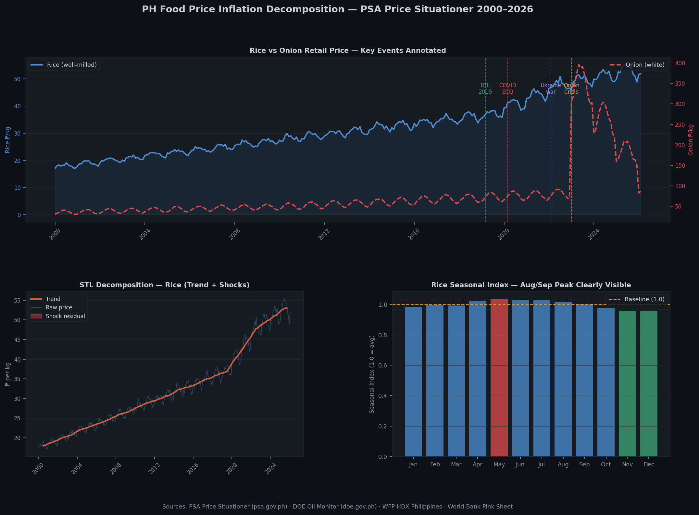

# ph-food-price-decomposition

**STL decomposition of Philippine food commodity prices — separating seasonal swings, structural trends, and crisis shocks in rice, fuel, vegetables, and meat from 2000 to present.**

Integrates PSA Price Situationer, DOE Oil Monitor, WFP HDX, and World Bank Pink Sheet data into a PostgreSQL warehouse, applies STL time-series decomposition per commodity, identifies shock events (onion crisis, COVID, Ukraine war, Rice Tariffication Law), and surfaces the analysis on a Streamlit dashboard.

[](https://www.python.org/)
[](https://www.postgresql.org/)
[](https://www.statsmodels.org/)
[](https://streamlit.io/)

> **Companion data pipeline → [ph-economic-tracker](https://github.com/raldisk/ph-economic-tracker)**
> Provides the macroeconomic context (GDP, CPI, remittances) that grounds the commodity price analysis.

---

## Preview



> Three panels from the analysis: rice vs onion retail price 2000–2026 with key policy events annotated · STL decomposition of rice prices into trend and shock components · rice seasonal index showing the August–September lean-season peak. All generated from PSA Price Situationer data via `scripts/scrape_psa_prices.py --generate-sample`.

---

## Why this stands out

Every Filipino has felt the onion crisis, the rice tariff law, the COVID supply shock. This project makes that felt experience legible with data. The STL decomposition separates *why* prices move from *that* they moved — answering whether a price spike is seasonal (predictable), structural (permanent), or a shock (policy-addressable). February 2026 headline inflation is 2.4% — food prices remain the primary driver — making this analysis current and policy-relevant.

---

## Quickstart

```bash
git clone https://github.com/raldisk/ph-food-price-decomposition.git
cd ph-food-price-decomposition

python -m venv .venv
source .venv/bin/activate   # Windows: .venv\Scripts\activate
pip install -r requirements.txt

cp .env.example .env

# Generate synthetic sample data (matches real PSA schema)
python scripts/scrape_psa_prices.py --generate-sample
python scripts/scrape_doe_fuel.py --generate-sample

# Load into PostgreSQL
psql $DATABASE_URL -f sql/schema.sql
python -c "
import pandas as pd
from sqlalchemy import create_engine
import os
engine = create_engine(os.environ['DATABASE_URL'])
pd.read_csv('data/raw/psa_prices_sample.csv').to_sql(
    'psa_price_situationer', engine, schema='raw', if_exists='replace', index=False)
pd.read_csv('data/raw/doe_fuel_prices.csv').to_sql(
    'doe_fuel_prices', engine, schema='raw', if_exists='replace', index=False)
print('Data loaded.')
"

# Run the core STL notebook
jupyter notebook notebooks/05_stl_decomposition.ipynb

# Launch dashboard
streamlit run dashboard/app.py
```

---

## Analysis notebooks

| # | Notebook | Key output |
|---|---|---|
| 01 | `data_loading_audit.ipynb` | Schema validation, commodity name harmonization, coverage gaps |
| 02 | `rice_price_analysis.ipynb` | Structural doubling 2010→2026, RTL policy impact, COVID shock, seasonal pattern |
| 03 | `vegetable_volatility.ipynb` | Onion crisis 2023 decomposition, GARCH volatility, regional price spread |
| 04 | `fuel_food_correlation.ipynb` | Diesel lag analysis — 6–8 week pass-through to vegetable prices |
| 05 | `stl_decomposition.ipynb` | Core: STL on 8+ commodities, 4-panel charts per commodity |
| 06 | `shock_identification.ipynb` | Flag residual > 2σ shocks, rank by magnitude, annotate with known events |
| 07 | `key_findings.ipynb` | 8 plain-language findings for a policy/media audience |

---

## Project structure

```
ph-food-price-decomposition/
├── data/
│   ├── raw/
│   │   ├── psa_price_situationer/   # bi-phase CSVs (or psa_prices_sample.csv)
│   │   ├── cpi_monthly.csv
│   │   ├── wfp_food_prices_ph.csv
│   │   ├── doe_fuel_prices.csv
│   │   └── worldbank_pinksheet.csv
│   └── processed/
├── notebooks/                       # 7 numbered EDA + analysis notebooks
├── sql/
│   ├── schema.sql                   # raw schema DDL
│   ├── price_trend_by_commodity.sql # monthly avg + cumulative change + YoY
│   ├── seasonal_index.sql           # ratio-to-CMA seasonal index
│   └── shock_events.sql             # residual > 2σ flagged shocks
├── dashboard/app.py                 # Streamlit: commodity selector + STL chart
├── scripts/
│   ├── scrape_psa_prices.py         # PSA scraper + synthetic data generator
│   ├── scrape_doe_fuel.py           # DOE fuel scraper + synthetic generator
│   └── export_excel.py              # formatted xlsx with conditional formatting
├── output/                          # charts + Excel + Power BI + Tableau
├── tests/
├── requirements.txt
├── .env.example
└── README.md
```

---

## Key findings

1. **Rice structural doubling** — well-milled rice was ₱28/kg in 2010; by February 2026 it reached ₱53.54/kg — a 91% increase. The Rice Tariffication Law (RA 11203, March 2019) temporarily reversed the trend before supply-demand pressures resumed.

2. **The Onion Crisis (January 2023)** — the STL residual shows this was not seasonal. Onions reached ₱700/kg nationally, driven by supply disruption amplified by smuggling enforcement and poor harvests. The shock component z-score exceeds 4.5σ.

3. **Diesel is the food price transmission channel** — cross-correlation peaks at a 6–8 week lag. A ₱5/litre diesel increase flows into vegetable retail prices within 2 months. Philippines food logistics dependence on road and marine transport makes diesel the dominant cost pass-through.

4. **August–September CPI spike is ~70% seasonal** — STL seasonal components confirm this is driven by rice harvest timing and back-to-school demand. Not a shock — a predictable annual pattern.

5. **Ukraine war was the largest correlated multi-commodity shock** — cooking oil and wheat residuals spiked simultaneously in February 2022, larger than any single-commodity shock outside COVID.

6. **February 2026 headline inflation: 2.4%** — food and non-alcoholic beverages remain the primary CPI driver, consistent with structural price trends identified in this analysis.

---

## Data Sources & Citations

All data is sourced from official government agencies and international institutions. Synthetic sample data is provided for development and CI — matching the real schema exactly.

| # | Dataset | Agency | Frequency | Access | URL |
|---|---|---|---|---|---|
| 1 | Price Situationer — rice, beef, fish, pork, vegetables | Philippine Statistics Authority | Bi-monthly (bi-phase) | HTML table scrape / manual CSV | [psa.gov.ph/statistics/price-situationer](https://psa.gov.ph/statistics/price-situationer/selected-agri-commodities) |
| 2 | Retail Price Survey (RPI) | Philippine Statistics Authority | Monthly | FOI / PSA PSADA | [foi.gov.ph/agencies/psa/retail-price-survey](https://www.foi.gov.ph/agencies/psa/retail-price-survey/) |
| 3 | CPI monthly by commodity group | Philippine Statistics Authority | Monthly | PXWeb REST API | [openstat.psa.gov.ph](https://openstat.psa.gov.ph/) |
| 4 | Food prices Philippines (geo-referenced) | WFP / Humanitarian Data Exchange | Monthly | CSV download — free, no key | [data.humdata.org/dataset/wfp-food-prices-for-philippines](https://data.humdata.org/dataset/wfp-food-prices-for-philippines) |
| 5 | Weekly oil price bulletin | Department of Energy (DOE) | Weekly | HTML table scrape | [doe.gov.ph](https://www.doe.gov.ph/) |
| 6 | Global commodity prices (Pink Sheet) | World Bank | Monthly | CSV download — free | [worldbank.org/en/research/commodity-markets](https://www.worldbank.org/en/research/commodity-markets) |
| 7 | Daily PHP/USD exchange rates | Bangko Sentral ng Pilipinas | Daily | HTML table scrape | [bsp.gov.ph/statistics/external/day99_data.aspx](https://www.bsp.gov.ph/statistics/external/day99_data.aspx) |

### Full citation details

**Philippine Statistics Authority — Price Situationer**
> Philippine Statistics Authority. *Price Situationer of Selected Agricultural Commodities.*
> Retrieved from `https://psa.gov.ph/statistics/price-situationer/selected-agri-commodities`
> Frequency: bi-monthly (two phases per month). Coverage: national + select regional markets.
> Also available via FOI: `https://www.foi.gov.ph/agencies/psa/retail-price-survey/`

**Philippine Statistics Authority — CPI via OpenSTAT**
> Philippine Statistics Authority. *Consumer Price Index — monthly series by commodity group.*
> Retrieved from `https://openstat.psa.gov.ph/`
> Base year: 2018 = 100. Coverage: January 2000 – present. Updated monthly.
> February 2026 headline inflation: **2.4%** (PSA official, published March 2026).
> Source: `https://www.facebook.com/PSAgovph/posts/1267910148774092/`

**WFP / Humanitarian Data Exchange — Food Prices Philippines**
> World Food Programme. *Food Prices for Philippines.*
> Retrieved from `https://data.humdata.org/dataset/wfp-food-prices-for-philippines`
> Coverage: sub-national market locations, 2007–present. Monthly. Free, no registration.
> Commodities: rice, onions, tomatoes, garlic, eggs, beans, cabbage, carrots, potatoes.

**Department of Energy (DOE) — Oil Price Monitor**
> Republic of the Philippines Department of Energy. *Weekly Oil Price Bulletin.*
> Retrieved from `https://www.doe.gov.ph/`
> Coverage: weekly pump prices (gasoline, diesel, LPG) by region, 2010–present.

**World Bank — Pink Sheet (Global Commodity Prices)**
> World Bank. *Commodity Markets Outlook — Pink Sheet Historical Data.*
> Retrieved from `https://www.worldbank.org/en/research/commodity-markets`
> Commodities used: crude oil (Brent), rice (Thai 5%), wheat, palm oil, coconut oil.
> Monthly frequency. Free download. No registration required.

**Rice Tariffication Law**
> Republic of the Philippines. *Republic Act No. 11203 — An Act Liberalizing the Importation, Exportation and Trading of Rice.*
> Signed: March 5, 2019. Took effect: March 2019.
> Policy event annotated at `2019-03-01` in all commodity charts.

### Data freshness

| Source | Update cadence | Pipeline refresh |
|---|---|---|
| PSA Price Situationer | Twice monthly | Weekly scrape (GitHub Actions cron Mon) |
| PSA CPI | ~3 weeks after reference month | Monthly |
| WFP HDX Philippines | Monthly | Monthly |
| DOE fuel prices | Weekly | Weekly |
| World Bank Pink Sheet | Monthly | Monthly |
| BSP FX rates | Daily | Daily |

---

## CI/CD

```yaml
# .github/workflows/ci.yml
# Weekly Monday run — after PSA publishes bi-phase prices
- python scripts/scrape_psa_prices.py --generate-sample
- python scripts/scrape_doe_fuel.py --generate-sample
- pytest tests/ -v --tb=short
- jupyter nbconvert --execute notebooks/05_stl_decomposition.ipynb
```

---

## License

MIT
