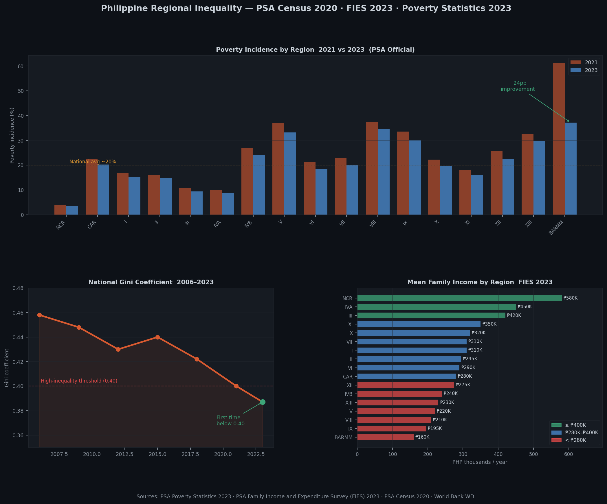

# ph-regional-inequality

**A data-driven look at income inequality across Philippine regions — using FIES, poverty statistics, and Census 2020 data to map who gets left behind.**

Combines PSA Family Income and Expenditure Survey (FIES) 2023, official poverty statistics, Small Area Estimates (1,611 LGUs), and Census 2020 population data into a six-notebook EDA with provincial choropleth maps, Gini trend analysis, and a Streamlit dashboard.

[](https://www.python.org/)
[](https://www.postgresql.org/)
[](https://jupyter.org/)
[](https://streamlit.io/)

> **Companion data pipeline → [ph-economic-tracker](https://github.com/raldisk/ph-economic-tracker)**
> Provides the macroeconomic context (GRDP, remittances, employment) that grounds the inequality analysis in broader economic trends.

---

## Preview



> Three views from the analysis: poverty incidence by region comparing 2021 vs 2023 — BARMM's 24-point improvement is the standout · National Gini coefficient 2006–2023 marking the first-ever drop below 0.40 in 2023 · Mean family income by region (FIES 2023) showing the stark NCR vs BARMM income gap.

---

## Key findings

- **2023 is a milestone year** — the national Gini coefficient dropped to 0.387, the first time it has fallen below 0.40, the threshold that defines high-inequality countries.
- **BARMM improved by 24 percentage points** in poverty incidence from 2021 to 2023 — the largest regional improvement nationally.
- **NCR poverty rose slightly during COVID** while BARMM fell — the usual narrative of Metro Manila resilience partially reverses under the data.
- **54.7% of 1,611 LGUs** now have poverty incidence at or below 20% (2023 SAE data).
- **Farmers and fisherfolk** remain the poorest occupational sectors at ~30% poverty incidence each.

---

## Quickstart

```bash
git clone https://github.com/raldisk/ph-regional-inequality.git
cd ph-regional-inequality

python -m venv .venv
source .venv/bin/activate        # Windows: .venv\Scripts\activate
pip install -r requirements.txt

# Download and load all PSA datasets
python scripts/download_data.py

# Launch notebooks
jupyter notebook notebooks/

# OR run the Streamlit dashboard
streamlit run dashboard/app.py
```

---

## Analysis notebooks

| # | Notebook | Key output |
|---|---|---|
| 01 | `data_loading_audit.ipynb` | Schema validation, PSGC code alignment, coverage gaps |
| 02 | `income_distribution_eda.ipynb` | Income decile distribution, mean vs median by region, FIES expenditure decomposition |
| 03 | `poverty_regional_analysis.ipynb` | Regional poverty ranking 2021 vs 2023, BARMM deep-dive, SAE municipal analysis |
| 04 | `gini_trend_analysis.ipynb` | National + regional Gini 2006–2023, Theil index decomposition, GRDP vs poverty correlation |
| 05 | `choropleth_maps.ipynb` | Provincial poverty incidence map, mean income map, delta (change) map |
| 06 | `key_findings.ipynb` | Policy-brief-style summary of 8 findings with supporting charts |

---

## Project structure

```
ph-regional-inequality/
├── data/
│   ├── raw/
│   │   ├── fies_2021.csv
│   │   ├── fies_2023.csv
│   │   ├── poverty_provincial_2023.csv
│   │   ├── poverty_sae_municipal_2023.csv
│   │   ├── census_2020_regional.csv
│   │   └── grdp_regional.csv
│   └── geo/
│       └── philippines_provinces.geojson
├── notebooks/
│   ├── 01_data_loading_audit.ipynb
│   ├── 02_income_distribution_eda.ipynb
│   ├── 03_poverty_regional_analysis.ipynb
│   ├── 04_gini_trend_analysis.ipynb
│   ├── 05_choropleth_maps.ipynb
│   └── 06_key_findings.ipynb
├── sql/
│   ├── schema.sql
│   ├── poverty_by_region.sql
│   ├── gini_trend.sql
│   └── fies_income_deciles.sql
├── dashboard/
│   └── app.py
├── scripts/
│   ├── download_data.py
│   └── export_excel.py
├── output/
│   ├── ph_inequality.pbix
│   ├── ph_inequality.twbx
│   └── ph_inequality_report.xlsx
├── docs/
│   └── preview.png
├── requirements.txt
└── README.md
```

---

## Data Sources & Citations

All data is sourced exclusively from official Philippine government agencies, international institutions, and one peer-reviewed academic source for geographic boundary files.

| # | Dataset | Agency | Granularity | Access Method | URL |
|---|---|---|---|---|---|
| 1 | Family Income and Expenditure Survey (FIES) 2021 | Philippine Statistics Authority | Regional / provincial | CSV download | [psa.gov.ph/statistics/income-expenditure](https://psa.gov.ph/statistics/income-expenditure) |
| 2 | Family Income and Expenditure Survey (FIES) 2023 | Philippine Statistics Authority | Regional / provincial | CSV download | [psa.gov.ph/statistics/income-expenditure](https://psa.gov.ph/statistics/income-expenditure) |
| 3 | Official Poverty Statistics 2023 | Philippine Statistics Authority | Provincial + HUC level | CSV download | [psa.gov.ph/statistics/poverty](https://psa.gov.ph/statistics/poverty) |
| 4 | Small Area Estimates (SAE) 2023 — poverty incidence | Philippine Statistics Authority | Municipal (1,611 LGUs) | CSV download | [psa.gov.ph/statistics/poverty](https://psa.gov.ph/statistics/poverty) |
| 5 | 2020 Census of Population and Housing | Philippine Statistics Authority | Municipal / barangay | FOI / CSV download | [foi.gov.ph/agencies/psa/2020-census-report](https://www.foi.gov.ph/agencies/psa/2020-census-report/) |
| 6 | Gross Regional Domestic Product (GRDP) series | Philippine Statistics Authority | Regional, annual | PXWeb REST API | [openstat.psa.gov.ph](https://openstat.psa.gov.ph/) |
| 7 | Philippines administrative boundaries (GeoJSON) | GADM / HDX | Province / region polygons | Direct download | [gadm.org/country.html](https://gadm.org/country.html) |
| 8 | Poverty and inequality data (cross-reference) | World Bank | National | Indicators REST API | [api.worldbank.org/v2/](https://api.worldbank.org/v2/) |

### Full citation details

**Philippine Statistics Authority (PSA) — Family Income and Expenditure Survey (FIES)**
> Philippine Statistics Authority. *Family Income and Expenditure Survey 2021 and 2023.*
> Retrieved from `https://psa.gov.ph/statistics/income-expenditure`
> Coverage: all 17 regions, provincial breakdown. Conducted every 3 years.
> Used for: income decile distribution, mean/median family income, expenditure decomposition, Gini computation.

**Philippine Statistics Authority (PSA) — Official Poverty Statistics 2023**
> Philippine Statistics Authority. *Official Poverty Statistics of the Philippines — Full Year 2023.*
> Retrieved from `https://psa.gov.ph/statistics/poverty`
> Includes: provincial poverty incidence, poverty threshold, poverty gap, income gap.
> Small Area Estimates (SAE) cover 1,611 LGUs — the most granular public poverty data available.
> Also available via FOI: `https://www.foi.gov.ph/agencies/psa/retail-price-survey/`

**Philippine Statistics Authority (PSA) — 2020 Census of Population and Housing**
> Philippine Statistics Authority. *2020 Census of Population and Housing — Population Counts Declared Official.*
> Total Philippine population: **109,035,343** (official, declared by the President July 2021).
> Retrieved from `https://www.foi.gov.ph/agencies/psa/2020-census-report/`
> Coverage: all municipalities and barangays. Used for population-weighted poverty rates.

**PSA OpenSTAT — Gross Regional Domestic Product (GRDP)**
> Philippine Statistics Authority. *Gross Regional Domestic Product series — annual, by region.*
> Retrieved from `https://openstat.psa.gov.ph/`
> Used for: GRDP growth vs poverty reduction correlation analysis (Notebook 04).

**World Bank — World Development Indicators**
> World Bank. *Poverty and inequality indicators for the Philippines.*
> Retrieved from `https://api.worldbank.org/v2/country/PHL/`
> Key indicators: `SI.POV.GINI` (Gini index), `SI.POV.NAHC` (poverty headcount).
> National Gini ~0.40 as of 2021 (World Bank / PSA). License: CC BY 4.0.

**GADM — Global Administrative Areas**
> Global Administrative Areas (GADM). *Philippines administrative boundary polygons — level 1 (regions) and level 2 (provinces).*
> Retrieved from `https://gadm.org/country.html`
> Used for: `geopandas` + `folium` choropleth maps in Notebook 05.
> License: free for non-commercial use and academic research.

**Peer-reviewed reference**
> Mapa, D., & Albis, M. (2022). Regional poverty and inequality in the Philippines, 2000–2018.
> *World Development Perspectives*, 27.
> DOI: `https://doi.org/10.1016/j.wdp.2022.100435`
> Used for: methodological context and historical Gini trend validation.

### Verified data points

| Fact | Value | Source |
|---|---|---|
| 2020 PH total population | 109,035,343 | PSA CPH 2020 (official) |
| National Gini coefficient 2021 | ~0.40 | World Bank / PSA |
| National Gini coefficient 2023 | 0.387 | PSA (first below 0.40) |
| BARMM poverty incidence 2021 | 61.2% | PSA Official Poverty Statistics |
| BARMM poverty incidence 2023 | 37.2% | PSA Official Poverty Statistics |
| NCR poverty incidence 2023 | 3.5% | PSA Official Poverty Statistics |
| LGUs at or below 20% poverty | 54.7% of 1,611 | PSA SAE 2023 |

### Data freshness

| Source | Update cadence | Notes |
|---|---|---|
| FIES | Every 3 years (last: 2023) | Next release ~2026 |
| Official Poverty Statistics | Annual | 2023 full-year published mid-2024 |
| SAE poverty | Every 3 years | Aligned with FIES cycle |
| Census | Every 10 years (last: 2020) | Next: 2030 |
| GRDP | Annual | Via PSA OpenSTAT |

---

## CI/CD

```yaml
name: Inequality EDA Tests
on: [push, pull_request]
jobs:
  test:
    runs-on: ubuntu-latest
    steps:
      - uses: actions/checkout@v4
      - uses: actions/setup-python@v5
        with: { python-version: '3.11' }
      - run: pip install -r requirements.txt
      - run: pytest tests/ -v
      - run: python scripts/download_data.py --validate-only
      - run: jupyter nbconvert --to notebook --execute notebooks/01_data_loading_audit.ipynb
```

---

## License

MIT
