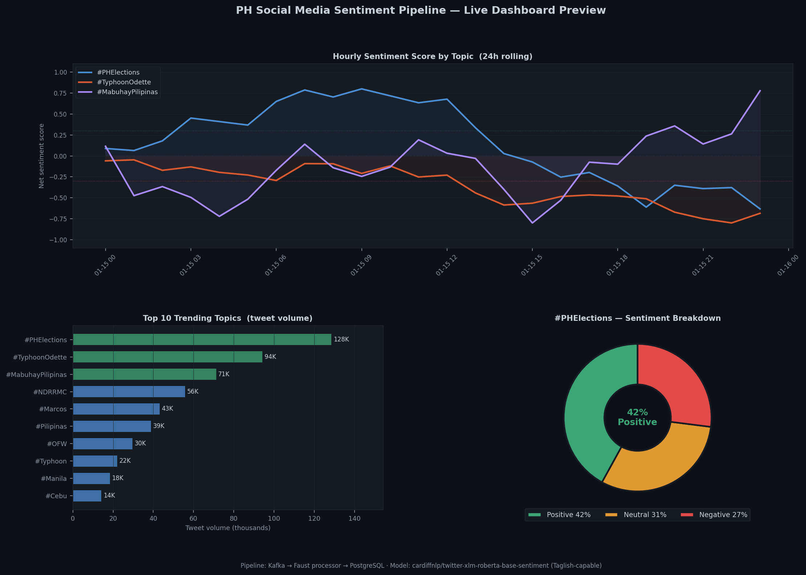

# ph-social-sentiment-pipeline

**Real-time PH social media sentiment pipeline — Kafka → PostgreSQL → Streamlit.**

Captures trending topics and classifies sentiment during Philippine elections and disaster events. Runs in simulation mode using pre-recorded fixtures with no API key required — always demonstrable in a job interview.

[](https://www.python.org/)
[](https://kafka.apache.org/)
[](https://www.postgresql.org/)
[](https://docs.getdbt.com/)
[](https://streamlit.io/)
[](https://huggingface.co/cardiffnlp/twitter-xlm-roberta-base-sentiment)

> **Companion data warehouse → [ph-economic-tracker](https://github.com/raldisk/ph-economic-tracker)**
> Provides the macroeconomic context that contextualizes social sentiment against real economic events.

---

## Preview



> Three views from the live dashboard: hourly sentiment score by top trending topics over 24h · top 10 trending topics by tweet volume · sentiment breakdown donut for the top topic. Built on `marts.sentiment_hourly` and `marts.trending_topics`.

---

## Why simulation mode matters

> Twitter/X free API was discontinued in August 2023. Basic tier costs $100/month.

The `fixtures/` directory contains pre-recorded JSON datasets from real trending topic events — the same format used in the DataCamp "Real-time Insights from Social Media Data" project. Running `python scripts/run_simulation.py` replays these through the full Kafka → processor → PostgreSQL → Streamlit stack with zero external dependencies. The pipeline is always demonstrable.

---

## Quickstart — simulation mode (recommended)

```bash
git clone https://github.com/raldisk/ph-social-sentiment-pipeline.git
cd ph-social-sentiment-pipeline

cp .env.example .env

# Start PostgreSQL + Kafka
docker compose up postgres kafka zookeeper -d

# Run simulation end-to-end (no API key needed)
docker compose run --rm simulator

# Launch dashboard
docker compose up streamlit -d
```

Open **http://localhost:8501** — live dashboard with 60-second auto-refresh.

---

## Architecture

```
┌──────────────────────────────────────────────────────────┐
│                    Producers (Python)                    │
│  producer/simulator.py      · replay JSON fixtures      │
│  producer/twitter_trends.py · live API (Basic tier)     │
│  producer/tweet_sampler.py  · keyword tweet stream      │
└───────────────────────┬──────────────────────────────────┘
                        │ JSON messages
                        ▼
┌──────────────────────────────────────────────────────────┐
│              Apache Kafka (Bitnami Docker)               │
│  topics: ph.trends.raw   ph.tweets.raw                  │
└───────────────────────┬──────────────────────────────────┘
                        │ consume
                        ▼
┌──────────────────────────────────────────────────────────┐
│              Stream Processor (Python / Faust)           │
│  processor/sentiment.py    · XLM-RoBERTa + VADER        │
│  processor/enrichment.py   · hashtag, mention extract   │
│  processor/aggregator.py   · 5-min rolling windows      │
└───────────────────────┬──────────────────────────────────┘
                        │ upsert ON CONFLICT
                        ▼
┌──────────────────────────────────────────────────────────┐
│         PostgreSQL 16 — raw + marts schema               │
│  raw.trend_snapshots    raw.tweet_events                 │
│  marts.sentiment_hourly  marts.trending_topics           │
│  marts.keyword_volume                                    │
└──────────────────────┬───────────────────────────────────┘
                       ▼
              Streamlit (live, 60s refresh)
```

---

## Sentiment model

**Primary:** `cardiffnlp/twitter-xlm-roberta-base-sentiment`
- Trained on 198M multilingual tweets
- Labels: `positive` / `neutral` / `negative`
- Handles English + Filipino + **Taglish** — critical for PH social media
- Runs on CPU; GPU optional

**Fallback:** VADER (NLTK) — English-only, CPU-fast, always available

---

## Project structure

```
ph-social-sentiment-pipeline/
├── src/ph_sentiment/
│   ├── config.py                    # pydantic-settings, env-driven
│   ├── models.py                    # Pydantic v2: TrendSnapshot, TweetEvent
│   ├── loader.py                    # PostgreSQL upsert + DDL
│   ├── producer/
│   │   ├── simulator.py             # fixture replay → Kafka (default mode)
│   │   ├── twitter_trends.py        # live Twitter/X API v2
│   │   └── tweet_sampler.py         # keyword-filtered stream
│   └── processor/
│       ├── sentiment.py             # XLM-RoBERTa + VADER fallback
│       ├── enrichment.py            # hashtag / mention extraction
│       └── aggregator.py            # 5-min windowed aggregation
├── transforms/                      # dbt project
│   └── models/
│       ├── staging/stg_tweet_events.sql
│       └── marts/
│           ├── sentiment_hourly.sql
│           ├── trending_topics.sql
│           └── keyword_volume.sql
├── dashboard/app.py                 # Streamlit live dashboard
├── notebooks/
│   ├── 01_fixture_eda.ipynb         # explore pre-recorded datasets
│   └── 02_sentiment_analysis.ipynb  # model evaluation + Taglish examples
├── fixtures/
│   ├── WWTrends.json                # pre-recorded worldwide trends
│   ├── USTrends.json                # pre-recorded US trends
│   └── WeLoveTheEarth.json          # tweet-level sample dataset
├── scripts/
│   ├── run_simulation.py            # end-to-end demo, no API key
│   └── export_excel.py              # hourly sentiment pivot → xlsx
├── tests/
├── Dockerfile
├── docker-compose.yml               # Kafka + Zookeeper + PostgreSQL + app
├── pyproject.toml
└── .env.example
```

---

## Data Sources & Citations

| # | Data | Source | Access | URL |
|---|---|---|---|---|
| 1 | Pre-recorded WW/US trending topics | Twitter/X (archived) | Included in `fixtures/` | DataCamp "Real-time Insights from Social Media Data" |
| 2 | Tweet sample dataset (WeLoveTheEarth) | Twitter/X (archived) | Included in `fixtures/` | DataCamp project fixtures |
| 3 | Live Twitter/X trends (optional) | Twitter/X API v2 | Basic tier ($100/mo) | [developer.twitter.com](https://developer.twitter.com/en/docs/twitter-api) |
| 4 | Sentiment model weights | HuggingFace / Cardiff NLP | Free download | [cardiffnlp/twitter-xlm-roberta-base-sentiment](https://huggingface.co/cardiffnlp/twitter-xlm-roberta-base-sentiment) |

### Full citation details

**Cardiff NLP — twitter-XLM-roBERTa sentiment model**
> Barbieri, F., Camacho-Collados, J., Neves, L., & Espinosa-Anke, L. (2020).
> *TweetEval: Unified Benchmark and Comparative Evaluation for Tweet Classification.*
> Findings of EMNLP 2020. HuggingFace model: `cardiffnlp/twitter-xlm-roberta-base-sentiment`
> Trained on 198M multilingual tweets. Handles Filipino/Taglish.
> License: MIT. Retrieved from `https://huggingface.co/cardiffnlp/twitter-xlm-roberta-base-sentiment`

**Twitter/X API v2**
> X Corp. *Twitter API v2 — Developer documentation.*
> Retrieved from `https://developer.twitter.com/en/docs/twitter-api`
> Note: Free tier discontinued August 2023 (TechCrunch, 2023-08-23).
> Basic tier ($100/month) required for filtered stream access.
> Simulation mode uses pre-recorded fixtures — no API key required for demo.

**Reference pipeline implementations**
> Shaikh, H. A. (2023). *Streaming Sentiment: Building a Real-Time NLP Pipeline with Kafka, Postgres & Streamlit.*
> Medium. Retrieved from `https://medium.com/@hasnains2006/streaming-sentiment-building-a-real-time-data-streaming-nlp-pipeline-with-kafka-postgres-f48805935ca4`

> Kav. (2023). *Building a Real-Time Data Streaming Pipeline for Sentiment Analysis using Kafka, Postgres and Streamlit.*
> Medium. Retrieved from `https://kavitmht.medium.com/building-a-real-time-data-streaming-pipeline-for-sentiment-analysis-using-kafka-postgres-and-4f1c11ba51c9`

---

## CI/CD

```yaml
# Runs on every push — no Kafka required (dry-run mode)
- pytest tests/ -v --tb=short -m "not integration"
- python scripts/run_simulation.py --dry-run
- dbt compile --profiles-dir transforms
- docker compose build
```

---

## License

MIT
